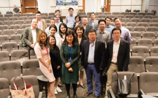
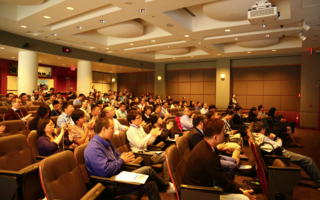
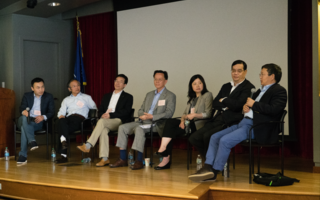
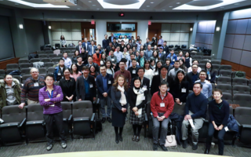

### About the Lab

    

    
    <!-- Left section goes here -->
    

 

  

  
  

    
    <!-- Right section goes here -->

<table>
  <tr>
    <td></td>
    <td></td>
  </tr>
  <tr>
    <td></td>
    <td></td>
  </tr>
  </tr>
    <td></td>
    <td></td>

</table>

    
  

  

